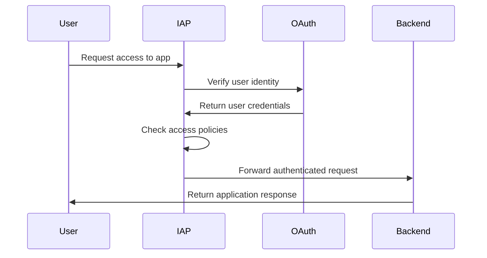

# Google Cloud Identity-Aware Proxy (IAP) - Complete Guide

A comprehensive guide to implementing secure, zero-trust access to your applications using Google Cloud Identity-Aware Proxy.

## 📋 Table of Contents

1. [What is Identity-Aware Proxy (IAP)](#what-is-identity-aware-proxy-iap)
2. [Core Components and Architecture](#core-components-and-architecture)
3. [Benefits and Use Cases](#benefits-and-use-cases)
4. [Prerequisites](#prerequisites)
5. [Hands-On Implementation](#hands-on-implementation)
6. [Real-World Example: Secure Web Application](#real-world-example-secure-web-application)
7. [Advanced Configurations](#advanced-configurations)
8. [Monitoring and Troubleshooting](#monitoring-and-troubleshooting)
9. [Best Practices](#best-practices)

## 🎯 What is Identity-Aware Proxy (IAP)?

### Definition

Identity-Aware Proxy (IAP) is Google Cloud's zero-trust security service that controls access to your cloud applications and VMs. It verifies user identity and context before granting access, eliminating the need for VPNs or bastion hosts.

### How IAP Works



### Key Features

#### 1. **Zero-Trust Security Model**
- No VPN required
- Identity verification for every request
- Context-aware access decisions

#### 2. **Centralized Access Control**
- Single point of access management
- Consistent policies across all applications
- Integration with Google Cloud IAM

#### 3. **Seamless User Experience**
- Single sign-on (SSO) integration
- Transparent authentication
- No additional client software required

## 🏗 Core Components and Architecture

### 1. IAP-Enabled Resources

#### **App Engine Applications**
- Automatic IAP integration
- Built-in authentication handling
- No additional configuration required

#### **Compute Engine Instances**
- VM-level access control
- SSH and RDP protection
- Port-specific access policies

#### **HTTPS Load Balancers**
- Application-level protection
- Custom backend services
- SSL termination with authentication

### 2. Authentication Flow

```
┌─────────────┐    ┌─────────────┐    ┌─────────────┐    ┌─────────────┐
│    User     │───▶│     IAP     │───▶│   OAuth     │───▶│  Backend    │
│             │    │   Gateway   │    │  Provider   │    │ Application │
└─────────────┘    └─────────────┘    └─────────────┘    └─────────────┘
       │                   │                   │                   │
       │                   │                   │                   │
       ▼                   ▼                   ▼                   ▼
   Request URL      Identity Check     User Verification    Serve Content
```

### 3. Access Control Mechanisms

#### **IAM Integration**
- Role-based access control
- Fine-grained permissions
- Group-based policies

#### **Context-Aware Access**
- Device trust levels
- Location-based restrictions
- Time-based access controls

## 🚀 Benefits and Use Cases

### Security Benefits

#### 1. **Zero-Trust Architecture**
- **Traditional VPN Issues**: Broad network access once connected
- **IAP Solution**: Application-specific access with continuous verification
- **Impact**: 90% reduction in lateral movement attacks

#### 2. **Centralized Authentication**
- **Challenge**: Multiple authentication systems
- **Solution**: Single identity provider integration
- **Benefit**: Reduced credential sprawl and improved audit trails

#### 3. **Context-Aware Security**
- **Device Verification**: Only trusted devices can access applications
- **Location Controls**: Restrict access based on geographic location
- **Time-Based Access**: Limit access to business hours

### Operational Benefits

#### 1. **Simplified Infrastructure**
- **No VPN Management**: Eliminate VPN servers and client configurations
- **Reduced Complexity**: Single access control point
- **Cost Savings**: 60% reduction in network security infrastructure costs

#### 2. **Enhanced User Experience**
- **Single Sign-On**: One login for all applications
- **Seamless Access**: No additional software installation
- **Mobile Friendly**: Works on any device with a web browser

#### 3. **Compliance and Audit**
- **Complete Logging**: Every access attempt is logged
- **Compliance Ready**: Meets SOC 2, HIPAA, and PCI DSS requirements
- **Audit Trails**: Detailed access reports for compliance teams

### Common Use Cases

#### 1. **Internal Applications**
- HR systems and employee portals
- Development and staging environments
- Administrative dashboards

#### 2. **Partner Access**
- Vendor portals and collaboration tools
- Third-party integrations
- Temporary contractor access

#### 3. **Remote Work Security**
- Secure access to corporate applications
- BYOD (Bring Your Own Device) policies
- Global workforce support

## 📋 Prerequisites

### Required Permissions

```bash
# Required IAM roles for setup
roles/iap.admin
roles/compute.admin
roles/iam.serviceAccountAdmin
roles/resourcemanager.projectIamAdmin
```

### Environment Setup

```bash
# Set project variables
export PROJECT_ID="your-gcp-project-id"
export REGION="us-central1"
export ZONE="us-central1-a"

# Authenticate and set project
gcloud auth login
gcloud config set project $PROJECT_ID
```

### Enable Required APIs

```bash
# Enable necessary APIs
gcloud services enable iap.googleapis.com
gcloud services enable compute.googleapis.com
gcloud services enable appengine.googleapis.com
gcloud services enable cloudbuild.googleapis.com
```

## 🛠 Hands-On Implementation

### Scenario 1: App Engine with IAP

#### Step 1: Create App Engine Application

```bash
# Create App Engine app
gcloud app create --region=$REGION
```

#### Step 2: Deploy Sample Application

Create a simple web application:

```python
# main.py
from flask import Flask, request
import os

app = Flask(__name__)

@app.route('/')
def hello():
    # IAP adds headers with user information
    user_email = request.headers.get('X-Goog-Authenticated-User-Email', 'Unknown')
    user_id = request.headers.get('X-Goog-Authenticated-User-ID', 'Unknown')
    
    return f'''
    <html>
    <head><title>IAP Protected App</title></head>
    <body>
        <h1>Welcome to IAP Protected Application!</h1>
        <p><strong>User Email:</strong> {user_email}</p>
        <p><strong>User ID:</strong> {user_id}</p>
        <p><strong>Request Headers:</strong></p>
        <ul>
            {''.join([f'<li>{k}: {v}</li>' for k, v in request.headers.items() if k.startswith('X-Goog')])}
        </ul>
    </body>
    </html>
    '''

if __name__ == '__main__':
    app.run(host='0.0.0.0', port=int(os.environ.get('PORT', 8080)))
```

```yaml
# app.yaml
runtime: python39

handlers:
- url: /.*
  script: auto
```

```txt
# requirements.txt
Flask==2.3.3
```

#### Step 3: Deploy Application

```bash
# Deploy to App Engine
gcloud app deploy

# Get the application URL
gcloud app browse
```

#### Step 4: Enable IAP

```bash
# Enable IAP for App Engine
gcloud iap web enable --resource-type=app-engine

# Set up OAuth consent screen (if not already configured)
gcloud iap oauth-brands create \
    --application_title="IAP Test Application" \
    --support_email="your-email@domain.com"
```

#### Step 5: Configure Access Policies

```bash
# Grant access to specific users
gcloud projects add-iam-policy-binding $PROJECT_ID \
    --member="user:user@example.com" \
    --role="roles/iap.httpsResourceAccessor"

# Grant access to a group
gcloud projects add-iam-policy-binding $PROJECT_ID \
    --member="group:developers@example.com" \
    --role="roles/iap.httpsResourceAccessor"
```

### Scenario 2: Compute Engine with IAP

#### Step 1: Create VM Instance

```bash
# Create a VM with IAP-enabled tags
gcloud compute instances create iap-test-vm \
    --zone=$ZONE \
    --machine-type=e2-micro \
    --image-family=ubuntu-2004-lts \
    --image-project=ubuntu-os-cloud \
    --tags=iap-ssh \
    --metadata=startup-script='#!/bin/bash
    apt-get update
    apt-get install -y nginx
    systemctl start nginx
    systemctl enable nginx
    echo "<h1>IAP Protected Server</h1>" > /var/www/html/index.html'
```

#### Step 2: Configure Firewall Rules

```bash
# Create firewall rule for IAP SSH access
gcloud compute firewall-rules create allow-iap-ssh \
    --direction=INGRESS \
    --priority=1000 \
    --network=default \
    --action=ALLOW \
    --rules=tcp:22 \
    --source-ranges=35.235.240.0/20 \
    --target-tags=iap-ssh

# Create firewall rule for IAP HTTP access
gcloud compute firewall-rules create allow-iap-http \
    --direction=INGRESS \
    --priority=1000 \
    --network=default \
    --action=ALLOW \
    --rules=tcp:80,tcp:443 \
    --source-ranges=35.235.240.0/20 \
    --target-tags=iap-ssh
```

#### Step 3: Enable IAP for SSH

```bash
# Grant IAP SSH access to users
gcloud projects add-iam-policy-binding $PROJECT_ID \
    --member="user:user@example.com" \
    --role="roles/iap.tunnelResourceAccessor"

gcloud projects add-iam-policy-binding $PROJECT_ID \
    --member="user:user@example.com" \
    --role="roles/compute.osLogin"
```

#### Step 4: Connect via IAP

```bash
# Connect to VM via IAP tunnel
gcloud compute ssh iap-test-vm \
    --zone=$ZONE \
    --tunnel-through-iap

# Create IAP tunnel for HTTP access
gcloud compute start-iap-tunnel iap-test-vm 80 \
    --local-host-port=localhost:8080 \
    --zone=$ZONE
```

### Scenario 3: HTTPS Load Balancer with IAP

#### Step 1: Create Backend Service

```bash
# Create instance group
gcloud compute instance-groups managed create iap-backend-group \
    --base-instance-name=iap-backend \
    --size=2 \
    --template=iap-instance-template \
    --zone=$ZONE

# Create instance template
gcloud compute instance-templates create iap-instance-template \
    --machine-type=e2-micro \
    --image-family=ubuntu-2004-lts \
    --image-project=ubuntu-os-cloud \
    --tags=http-server \
    --metadata=startup-script='#!/bin/bash
    apt-get update
    apt-get install -y nginx
    systemctl start nginx
    echo "<h1>IAP Backend Server - $(hostname)</h1>" > /var/www/html/index.html'

# Create backend service
gcloud compute backend-services create iap-backend-service \
    --protocol=HTTP \
    --port-name=http \
    --health-checks=basic-check \
    --global

# Add instance group to backend service
gcloud compute backend-services add-backend iap-backend-service \
    --instance-group=iap-backend-group \
    --instance-group-zone=$ZONE \
    --global
```

#### Step 2: Create Load Balancer

```bash
# Create URL map
gcloud compute url-maps create iap-url-map \
    --default-service=iap-backend-service

# Create SSL certificate (replace with your domain)
gcloud compute ssl-certificates create iap-ssl-cert \
    --domains=your-domain.com

# Create HTTPS proxy
gcloud compute target-https-proxies create iap-https-proxy \
    --url-map=iap-url-map \
    --ssl-certificates=iap-ssl-cert

# Create forwarding rule
gcloud compute forwarding-rules create iap-https-rule \
    --address=iap-static-ip \
    --global \
    --target-https-proxy=iap-https-proxy \
    --ports=443
```

#### Step 3: Enable IAP for Load Balancer

```bash
# Enable IAP for the backend service
gcloud iap web enable --resource-type=backend-services \
    --service=iap-backend-service

# Configure OAuth consent screen
gcloud iap oauth-clients create \
    --brand=projects/$PROJECT_ID/brands/BRAND_ID
```

## 🏢 Real-World Example: Secure Web Application

### Scenario: E-commerce Admin Dashboard

**Company**: TechMart E-commerce  
**Challenge**: Secure access to admin dashboard for employees and partners  
**Requirements**:
- Role-based access control
- Multi-environment support (staging, production)
- Audit logging
- Mobile access support

### Implementation Architecture

```
┌─────────────┐    ┌─────────────┐    ┌─────────────┐
│   Employees │    │   Partners  │    │ Contractors │
│             │    │             │    │             │
└──────┬──────┘    └──────┬──────┘    └──────┬──────┘
       │                  │                  │
       └──────────────────┼──────────────────┘
                          │
                   ┌──────▼──────┐
                   │     IAP     │
                   │   Gateway   │
                   └──────┬──────┘
                          │
       ┌──────────────────┼──────────────────┐
       │                  │                  │
┌──────▼──────┐    ┌──────▼──────┐    ┌──────▼──────┐
│   Staging   │    │ Production  │    │   Reports   │
│  Dashboard  │    │  Dashboard  │    │   Service   │
└─────────────┘    └─────────────┘    └─────────────┘
```

### Step-by-Step Implementation

#### Step 1: Create Multi-Environment Setup

```bash
# Create staging environment
gcloud compute instances create admin-dashboard-staging \
    --zone=$ZONE \
    --machine-type=e2-standard-2 \
    --image-family=ubuntu-2004-lts \
    --image-project=ubuntu-os-cloud \
    --tags=iap-staging \
    --metadata=startup-script='#!/bin/bash
    apt-get update
    apt-get install -y docker.io
    systemctl start docker
    systemctl enable docker
    
    # Run staging admin dashboard
    docker run -d -p 80:3000 \
        -e NODE_ENV=staging \
        -e APP_TITLE="TechMart Admin - Staging" \
        --name admin-dashboard \
        nginx:alpine
    
    # Create custom index page
    docker exec admin-dashboard sh -c "echo \"<h1>TechMart Admin Dashboard - Staging</h1><p>Environment: Staging</p><p>Server: $(hostname)</p>\" > /usr/share/nginx/html/index.html"'

# Create production environment
gcloud compute instances create admin-dashboard-prod \
    --zone=$ZONE \
    --machine-type=e2-standard-4 \
    --image-family=ubuntu-2004-lts \
    --image-project=ubuntu-os-cloud \
    --tags=iap-production \
    --metadata=startup-script='#!/bin/bash
    apt-get update
    apt-get install -y docker.io
    systemctl start docker
    systemctl enable docker
    
    # Run production admin dashboard
    docker run -d -p 80:3000 \
        -e NODE_ENV=production \
        -e APP_TITLE="TechMart Admin - Production" \
        --name admin-dashboard \
        nginx:alpine
    
    # Create custom index page
    docker exec admin-dashboard sh -c "echo \"<h1>TechMart Admin Dashboard - Production</h1><p>Environment: Production</p><p>Server: $(hostname)</p>\" > /usr/share/nginx/html/index.html"'
```

#### Step 2: Configure Load Balancers

```bash
# Create health check
gcloud compute health-checks create http admin-health-check \
    --port=80 \
    --request-path=/

# Create backend services for each environment
gcloud compute backend-services create staging-backend \
    --protocol=HTTP \
    --health-checks=admin-health-check \
    --global

gcloud compute backend-services create production-backend \
    --protocol=HTTP \
    --health-checks=admin-health-check \
    --global

# Add instances to backend services
gcloud compute backend-services add-backend staging-backend \
    --instance=admin-dashboard-staging \
    --instance-zone=$ZONE \
    --global

gcloud compute backend-services add-backend production-backend \
    --instance=admin-dashboard-prod \
    --instance-zone=$ZONE \
    --global

# Create URL maps with path-based routing
gcloud compute url-maps create admin-url-map \
    --default-service=production-backend

gcloud compute url-maps add-path-matcher admin-url-map \
    --path-matcher-name=staging-matcher \
    --default-service=staging-backend \
    --path-rules="/staging/*=staging-backend"

# Create SSL certificate
gcloud compute ssl-certificates create admin-ssl-cert \
    --domains=admin.techmart.com

# Create HTTPS proxy
gcloud compute target-https-proxies create admin-https-proxy \
    --url-map=admin-url-map \
    --ssl-certificates=admin-ssl-cert

# Create global IP and forwarding rule
gcloud compute addresses create admin-ip --global

gcloud compute forwarding-rules create admin-https-rule \
    --address=admin-ip \
    --global \
    --target-https-proxy=admin-https-proxy \
    --ports=443
```

#### Step 3: Enable IAP with Role-Based Access

```bash
# Enable IAP for both environments
gcloud iap web enable --resource-type=backend-services \
    --service=staging-backend

gcloud iap web enable --resource-type=backend-services \
    --service=production-backend

# Create custom IAM roles
gcloud iam roles create stagingAdmin \
    --project=$PROJECT_ID \
    --title="Staging Admin" \
    --description="Access to staging environment" \
    --permissions="iap.httpsResourceAccessor"

gcloud iam roles create productionAdmin \
    --project=$PROJECT_ID \
    --title="Production Admin" \
    --description="Access to production environment" \
    --permissions="iap.httpsResourceAccessor"

# Grant access to different user groups
# Developers - Staging access only
gcloud projects add-iam-policy-binding $PROJECT_ID \
    --member="group:developers@techmart.com" \
    --role="roles/iap.httpsResourceAccessor" \
    --condition='title=Staging Only,description=Access to staging environment only,expression=request.path.startsWith("/staging")'

# Admins - Full access
gcloud projects add-iam-policy-binding $PROJECT_ID \
    --member="group:admins@techmart.com" \
    --role="roles/iap.httpsResourceAccessor"

# Partners - Limited production access
gcloud projects add-iam-policy-binding $PROJECT_ID \
    --member="group:partners@techmart.com" \
    --role="roles/iap.httpsResourceAccessor" \
    --condition='title=Business Hours,description=Access during business hours only,expression=request.time.getHours() >= 9 && request.time.getHours() <= 17'
```

#### Step 4: Configure Advanced Security

```bash
# Create access levels for context-aware access
gcloud access-context-manager policies create \
    --title="TechMart Access Policy" \
    --organization=$ORG_ID

# Create access level for trusted devices
gcloud access-context-manager levels create TrustedDevices \
    --policy=$POLICY_ID \
    --title="Trusted Devices" \
    --basic-level-spec=device_policy.yaml

# device_policy.yaml content:
cat > device_policy.yaml << EOF
devicePolicy:
  requireScreenlock: true
  requireAdminApproval: true
  requireCorpOwned: true
regions:
- US
- CA
- GB
EOF

# Apply access level to IAP
gcloud iap web set-iam-policy staging-backend policy.yaml
```

#### Step 5: Implement Monitoring and Alerting

```bash
# Create log-based metrics
gcloud logging metrics create iap_access_denied \
    --description="IAP access denied events" \
    --log-filter='protoPayload.serviceName="iap.googleapis.com" AND protoPayload.authenticationInfo.principalEmail!=""'

# Create alerting policy
gcloud alpha monitoring policies create \
    --policy-from-file=iap-alert-policy.yaml
```

```yaml
# iap-alert-policy.yaml
displayName: "IAP Access Denied Alert"
conditions:
  - displayName: "High number of access denials"
    conditionThreshold:
      filter: 'metric.type="logging.googleapis.com/user/iap_access_denied"'
      comparison: COMPARISON_GREATER_THAN
      thresholdValue: 10
      duration: 300s
notificationChannels:
  - projects/PROJECT_ID/notificationChannels/CHANNEL_ID
alertStrategy:
  autoClose: 86400s
```

### Testing the Implementation

#### Test 1: Basic Access

```bash
# Test staging access
curl -H "Authorization: Bearer $(gcloud auth print-access-token)" \
     https://admin.techmart.com/staging/

# Test production access
curl -H "Authorization: Bearer $(gcloud auth print-access-token)" \
     https://admin.techmart.com/
```

#### Test 2: Role-Based Access

```bash
# Test with different user accounts
gcloud auth login user1@techmart.com  # Developer
gcloud auth login user2@techmart.com  # Admin
gcloud auth login partner@external.com  # Partner

# Access staging (should work for developers and admins)
curl -H "Authorization: Bearer $(gcloud auth print-access-token)" \
     https://admin.techmart.com/staging/

# Access production (should work only for admins and partners during business hours)
curl -H "Authorization: Bearer $(gcloud auth print-access-token)" \
     https://admin.techmart.com/
```

## 🔧 Advanced Configurations

### 1. Custom OAuth Clients

```bash
# Create custom OAuth client for mobile app
gcloud iap oauth-clients create \
    --brand=projects/$PROJECT_ID/brands/$BRAND_ID \
    --display_name="TechMart Mobile Admin"

# Get client credentials
gcloud iap oauth-clients list --brand=projects/$PROJECT_ID/brands/$BRAND_ID
```

### 2. Programmatic Access

```python
# Python example for programmatic IAP access
import google.auth
import google.auth.transport.requests
import requests

def make_iap_request(url, client_id, method='GET', **kwargs):
    """Make a request to an IAP-protected resource."""
    
    # Get credentials
    credentials, project = google.auth.default()
    
    # Create IAP JWT
    from google.oauth2 import service_account
    from google.auth.transport.requests import Request
    import google.auth.jwt as jwt
    
    # Create JWT for IAP
    now = time.time()
    payload = {
        'iss': credentials.service_account_email,
        'sub': credentials.service_account_email,
        'target_audience': client_id,
        'aud': 'https://www.googleapis.com/oauth2/v4/token',
        'iat': now,
        'exp': now + 3600
    }
    
    # Sign JWT
    signed_jwt = jwt.encode(credentials.signer, payload)
    
    # Exchange for access token
    token_request = google.auth.transport.requests.Request()
    token_response = requests.post(
        'https://www.googleapis.com/oauth2/v4/token',
        data={
            'grant_type': 'urn:ietf:params:oauth:grant-type:jwt-bearer',
            'assertion': signed_jwt
        }
    )
    
    access_token = token_response.json()['access_token']
    
    # Make request with IAP token
    headers = {'Authorization': f'Bearer {access_token}'}
    return requests.request(method, url, headers=headers, **kwargs)

# Usage
response = make_iap_request(
    'https://admin.techmart.com/api/users',
    'your-client-id.apps.googleusercontent.com'
)
```

### 3. Context-Aware Access Policies

```yaml
# access-policy.yaml
title: "TechMart Context-Aware Policy"
basicLevels:
  - title: "TrustedDevices"
    conditions:
      - devicePolicy:
          requireScreenlock: true
          requireAdminApproval: true
          osConstraints:
            - osType: DESKTOP_WINDOWS
              minimumVersion: "10.0.0"
            - osType: DESKTOP_MAC
              minimumVersion: "10.15"
      - regions: ["US", "CA", "GB"]
      - ipSubnetworks: ["203.0.113.0/24"]
  
  - title: "BusinessHours"
    conditions:
      - dateTime:
          timeZone: "America/New_York"
          recurringTimeOfDay:
            - startTime: "09:00:00"
              endTime: "17:00:00"
            - days: ["MONDAY", "TUESDAY", "WEDNESDAY", "THURSDAY", "FRIDAY"]
```

### 4. Custom Headers and Claims

```bash
# Configure custom headers to pass to backend
gcloud iap web set-iam-policy backend-service policy.yaml

# policy.yaml with custom bindings
bindings:
  - members:
    - user:admin@techmart.com
    role: roles/iap.httpsResourceAccessor
    condition:
      title: "Admin Access"
      description: "Full admin access with custom headers"
      expression: 'request.headers["x-user-role"] == "admin"'
```

## 📊 Monitoring and Troubleshooting

### Key Metrics to Monitor

#### 1. Access Metrics
```bash
# Create custom dashboard
gcloud monitoring dashboards create --config-from-file=iap-dashboard.json
```

```json
{
  "displayName": "IAP Monitoring Dashboard",
  "mosaicLayout": {
    "tiles": [
      {
        "width": 6,
        "height": 4,
        "widget": {
          "title": "IAP Authentication Success Rate",
          "xyChart": {
            "dataSets": [{
              "timeSeriesQuery": {
                "timeSeriesFilter": {
                  "filter": "resource.type=\"gce_instance\" AND metric.type=\"iap.googleapis.com/request_count\"",
                  "aggregation": {
                    "alignmentPeriod": "60s",
                    "perSeriesAligner": "ALIGN_RATE"
                  }
                }
              }
            }]
          }
        }
      }
    ]
  }
}
```

#### 2. Common Issues and Solutions

**Issue 1: "Access Denied" Errors**
```bash
# Check IAM bindings
gcloud projects get-iam-policy $PROJECT_ID \
    --flatten="bindings[].members" \
    --filter="bindings.role:iap"

# Verify OAuth configuration
gcloud iap oauth-brands list
gcloud iap oauth-clients list --brand=BRAND_ID
```

**Issue 2: SSL Certificate Problems**
```bash
# Check certificate status
gcloud compute ssl-certificates describe CERT_NAME --global

# Update certificate
gcloud compute ssl-certificates create new-cert \
    --domains=your-domain.com \
    --global
```

**Issue 3: Backend Health Check Failures**
```bash
# Check backend service health
gcloud compute backend-services get-health BACKEND_SERVICE --global

# Update health check
gcloud compute health-checks update http HEALTH_CHECK \
    --port=80 \
    --request-path=/health
```

### Debugging Commands

```bash
# View IAP logs
gcloud logging read 'protoPayload.serviceName="iap.googleapis.com"' \
    --limit=50 \
    --format="table(timestamp,protoPayload.authenticationInfo.principalEmail,protoPayload.methodName)"

# Check access policies
gcloud iap web get-iam-policy --resource-type=backend-services \
    --service=BACKEND_SERVICE

# Test connectivity
gcloud compute ssh INSTANCE_NAME --tunnel-through-iap --zone=ZONE
```

## 🏆 Best Practices

### Security Best Practices

#### 1. **Principle of Least Privilege**
```bash
# Create specific roles instead of broad access
gcloud iam roles create limitedIapAccess \
    --project=$PROJECT_ID \
    --title="Limited IAP Access" \
    --permissions="iap.httpsResourceAccessor"

# Use conditions for time-based access
--condition='title=Business Hours,expression=request.time.getHours() >= 9 && request.time.getHours() <= 17'
```

#### 2. **Multi-Layer Security**
```bash
# Combine IAP with VPC firewall rules
gcloud compute firewall-rules create deny-direct-access \
    --direction=INGRESS \
    --priority=1000 \
    --network=default \
    --action=DENY \
    --rules=tcp:80,tcp:443 \
    --source-ranges=0.0.0.0/0 \
    --target-tags=iap-protected

# Allow only IAP traffic
gcloud compute firewall-rules create allow-iap-only \
    --direction=INGRESS \
    --priority=900 \
    --network=default \
    --action=ALLOW \
    --rules=tcp:80,tcp:443 \
    --source-ranges=35.235.240.0/20 \
    --target-tags=iap-protected
```

#### 3. **Regular Access Reviews**
```bash
# Automated access review script
#!/bin/bash
echo "IAP Access Review - $(date)"
echo "================================"

# List all IAP-enabled resources
gcloud iap web list

# Check IAM bindings for each resource
for service in $(gcloud compute backend-services list --format="value(name)"); do
    echo "Backend Service: $service"
    gcloud iap web get-iam-policy --resource-type=backend-services --service=$service
    echo "---"
done
```

### Operational Best Practices

#### 1. **Monitoring and Alerting**
```bash
# Set up comprehensive monitoring
gcloud logging sinks create iap-security-sink \
    bigquery.googleapis.com/projects/$PROJECT_ID/datasets/security_logs \
    --log-filter='protoPayload.serviceName="iap.googleapis.com"'

# Create alert for failed authentications
gcloud alpha monitoring policies create \
    --policy-from-file=failed-auth-alert.yaml
```

#### 2. **Backup and Recovery**
```bash
# Export IAP configuration
gcloud iap web get-iam-policy --resource-type=app-engine > iap-backup.yaml

# Backup OAuth configuration
gcloud iap oauth-brands list --format=json > oauth-brands-backup.json
gcloud iap oauth-clients list --brand=BRAND_ID --format=json > oauth-clients-backup.json
```

#### 3. **Testing and Validation**
```bash
# Automated testing script
#!/bin/bash
test_iap_access() {
    local url=$1
    local expected_status=$2
    
    response=$(curl -s -o /dev/null -w "%{http_code}" \
        -H "Authorization: Bearer $(gcloud auth print-access-token)" \
        "$url")
    
    if [ "$response" -eq "$expected_status" ]; then
        echo "✅ $url - Expected: $expected_status, Got: $response"
    else
        echo "❌ $url - Expected: $expected_status, Got: $response"
    fi
}

# Test different endpoints
test_iap_access "https://admin.techmart.com/" 200
test_iap_access "https://admin.techmart.com/staging/" 200
test_iap_access "https://admin.techmart.com/unauthorized" 403
```

## 🎯 Summary

This comprehensive guide covered:

1. **IAP Fundamentals** - Understanding zero-trust architecture and core components
2. **Practical Implementation** - Step-by-step setup for App Engine, Compute Engine, and Load Balancers
3. **Real-World Example** - Complete e-commerce admin dashboard with role-based access
4. **Advanced Features** - Context-aware access, custom OAuth clients, and programmatic access
5. **Monitoring & Troubleshooting** - Comprehensive monitoring setup and common issue resolution
6. **Best Practices** - Security, operational, and testing guidelines

### Key Benefits Achieved

- **Zero-Trust Security**: Eliminated VPN dependencies with identity-based access control
- **Simplified Management**: Centralized access control for all applications
- **Enhanced Compliance**: Complete audit trails and policy enforcement
- **Improved User Experience**: Seamless SSO across all protected resources
- **Cost Optimization**: Reduced infrastructure complexity and management overhead

### Next Steps

1. **Start Small**: Begin with a single App Engine application
2. **Expand Gradually**: Add Compute Engine and Load Balancer resources
3. **Implement Monitoring**: Set up comprehensive logging and alerting
4. **Regular Reviews**: Conduct periodic access reviews and policy updates
5. **Advanced Features**: Explore context-aware access and custom integrations

IAP provides enterprise-grade security while maintaining simplicity and user experience, making it ideal for modern cloud-native applications.