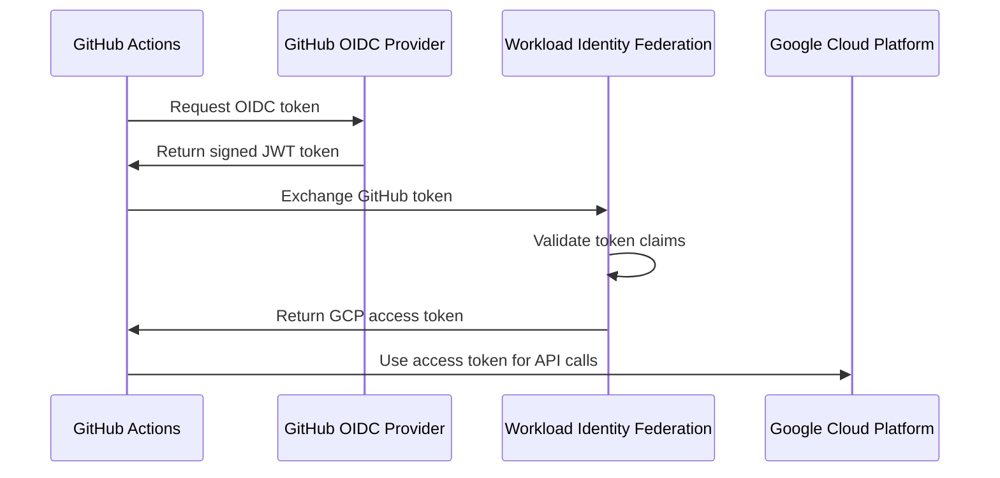

# GCP Workload Identity Pool with GitHub Actions - Complete Guide

A comprehensive guide to implementing secure, keyless authentication between GitHub Actions and Google Cloud Platform using Workload Identity Federation.

## 📋 Table of Contents

1. [Introduction to Workload Identity Pool](#introduction-to-workload-identity-pool)
2. [Benefits and Security Advantages](#benefits-and-security-advantages)
3. [Prerequisites](#prerequisites)
4. [Step-by-Step Implementation](#step-by-step-implementation)
5. [Real-World Use Case: E-commerce Platform Deployment](#real-world-use-case-e-commerce-platform-deployment)
6. [Advanced Configurations](#advanced-configurations)
7. [Troubleshooting](#troubleshooting)
8. [Best Practices](#best-practices)

## 🎯 Introduction to Workload Identity Pool

### What is Workload Identity Federation?

Workload Identity Federation allows external workloads (like GitHub Actions) to authenticate to Google Cloud without storing long-lived service account keys. Instead, it uses short-lived access tokens based on the workload's identity.

### Core Components

#### 1. Workload Identity Pool
- **Definition**: A container that manages external identity providers
- **Purpose**: Groups and manages external identities that can access GCP resources
- **Scope**: Project-level resource that can be shared across multiple workloads

#### 2. Workload Identity Provider
- **Definition**: Represents a specific external identity provider (e.g., GitHub)
- **Function**: Maps external tokens to Google Cloud identities
- **Configuration**: Defines how to validate and extract claims from external tokens

#### 3. Service Account Impersonation
- **Mechanism**: External identities assume GCP service account roles
- **Security**: No long-lived keys, only temporary token exchange
- **Granularity**: Fine-grained permissions through IAM bindings

### How It Works



## 🚀 Benefits and Security Advantages

### Security Benefits

#### 1. **Eliminates Long-Lived Keys**
- **Traditional Risk**: Service account keys never expire by default
- **Solution**: Short-lived tokens (1 hour maximum)
- **Impact**: Reduces credential theft and misuse risks

#### 2. **Zero Secret Management**
- **Traditional Challenge**: Storing and rotating service account keys
- **Solution**: No secrets to manage in GitHub repositories
- **Benefit**: Eliminates secret sprawl and rotation overhead

#### 3. **Principle of Least Privilege**
- **Granular Control**: Map specific GitHub repositories to specific GCP permissions
- **Conditional Access**: Restrict access based on branch, environment, or repository
- **Audit Trail**: Complete logging of all authentication attempts

#### 4. **Automatic Token Rotation**
- **Frequency**: Tokens automatically refresh every hour
- **No Downtime**: Seamless token renewal without service interruption
- **Compliance**: Meets security requirements for token lifecycle management

### Operational Benefits

#### 1. **Simplified CI/CD Pipeline**
- **No Key Distribution**: No need to distribute keys across environments
- **Faster Onboarding**: New repositories can be configured in minutes
- **Reduced Maintenance**: No key rotation procedures required

#### 2. **Enhanced Auditability**
- **Complete Traceability**: Every action tied to specific GitHub workflow
- **Detailed Logging**: Cloud Audit Logs capture all authentication events
- **Compliance Ready**: Meets SOC 2, ISO 27001, and other compliance requirements

#### 3. **Cost Optimization**
- **Reduced Overhead**: No key management infrastructure required
- **Faster Development**: Developers focus on code, not credential management
- **Lower Risk**: Reduced security incident response costs

## 📋 Prerequisites

### Required Tools and Access

```bash
# Install Google Cloud CLI
curl https://sdk.cloud.google.com | bash
exec -l $SHELL

# Verify installation
gcloud version

# Install GitHub CLI (optional but recommended)
brew install gh  # macOS
# or
sudo apt install gh  # Ubuntu
```

### Required Permissions

#### GCP Project Permissions
- `resourcemanager.projects.setIamPolicy`
- `iam.workloadIdentityPools.create`
- `iam.workloadIdentityProviders.create`
- `iam.serviceAccounts.create`
- `iam.serviceAccounts.setIamPolicy`

#### GitHub Repository Permissions
- Repository admin access or Actions write permissions
- Ability to configure repository secrets (for project information)

### Environment Setup

```bash
# Set project variables
export PROJECT_ID="your-gcp-project-id"
export PROJECT_NUMBER=$(gcloud projects describe $PROJECT_ID --format="value(projectNumber)")
export POOL_ID="github-actions-pool"
export PROVIDER_ID="github-provider"
export SERVICE_ACCOUNT_NAME="github-actions-sa"
export REPO_OWNER="your-github-username"
export REPO_NAME="your-repository-name"

# Authenticate to GCP
gcloud auth login
gcloud config set project $PROJECT_ID
```

## 🛠 Step-by-Step Implementation

### Step 1: Enable Required APIs

```bash
# Enable necessary GCP APIs
gcloud services enable iamcredentials.googleapis.com
gcloud services enable sts.googleapis.com
gcloud services enable cloudresourcemanager.googleapis.com

# Verify APIs are enabled
gcloud services list --enabled --filter="name:(iamcredentials.googleapis.com OR sts.googleapis.com)"
```

### Step 2: Create Workload Identity Pool

```bash
# Create the workload identity pool
gcloud iam workload-identity-pools create $POOL_ID \
    --project=$PROJECT_ID \
    --location="global" \
    --display-name="GitHub Actions Pool" \
    --description="Workload Identity Pool for GitHub Actions workflows"

# Verify pool creation
gcloud iam workload-identity-pools describe $POOL_ID \
    --project=$PROJECT_ID \
    --location="global"
```

### Step 3: Create Workload Identity Provider

```bash
# Create the GitHub OIDC provider
gcloud iam workload-identity-pools providers create-oidc $PROVIDER_ID \
    --project=$PROJECT_ID \
    --location="global" \
    --workload-identity-pool=$POOL_ID \
    --display-name="GitHub Provider" \
    --attribute-mapping="google.subject=assertion.sub,attribute.actor=assertion.actor,attribute.repository=assertion.repository,attribute.repository_owner=assertion.repository_owner,attribute.refs=assertion.ref" \
    --attribute-condition="assertion.repository_owner=='$REPO_OWNER'" \
    --issuer-uri="https://token.actions.githubusercontent.com"

# Get the provider resource name
export WORKLOAD_IDENTITY_PROVIDER="projects/$PROJECT_NUMBER/locations/global/workloadIdentityPools/$POOL_ID/providers/$PROVIDER_ID"

echo "Workload Identity Provider: $WORKLOAD_IDENTITY_PROVIDER"
```

### Step 4: Create Service Account

```bash
# Create service account for GitHub Actions
gcloud iam service-accounts create $SERVICE_ACCOUNT_NAME \
    --project=$PROJECT_ID \
    --display-name="GitHub Actions Service Account" \
    --description="Service account for GitHub Actions workflows"

# Get service account email
export SERVICE_ACCOUNT_EMAIL="$SERVICE_ACCOUNT_NAME@$PROJECT_ID.iam.gserviceaccount.com"

echo "Service Account Email: $SERVICE_ACCOUNT_EMAIL"
```

### Step 5: Grant Permissions to Service Account

```bash
# Grant necessary permissions (customize based on your needs)
# Example: Cloud Run deployment permissions
gcloud projects add-iam-policy-binding $PROJECT_ID \
    --member="serviceAccount:$SERVICE_ACCOUNT_EMAIL" \
    --role="roles/run.admin"

gcloud projects add-iam-policy-binding $PROJECT_ID \
    --member="serviceAccount:$SERVICE_ACCOUNT_EMAIL" \
    --role="roles/storage.admin"

gcloud projects add-iam-policy-binding $PROJECT_ID \
    --member="serviceAccount:$SERVICE_ACCOUNT_EMAIL" \
    --role="roles/artifactregistry.writer"

# Grant Cloud Build permissions for container builds
gcloud projects add-iam-policy-binding $PROJECT_ID \
    --member="serviceAccount:$SERVICE_ACCOUNT_EMAIL" \
    --role="roles/cloudbuild.builds.editor"
```

### Step 6: Configure Workload Identity Federation Binding

```bash
# Allow GitHub Actions to impersonate the service account
gcloud iam service-accounts add-iam-policy-binding $SERVICE_ACCOUNT_EMAIL \
    --project=$PROJECT_ID \
    --role="roles/iam.workloadIdentityUser" \
    --member="principalSet://iam.googleapis.com/projects/$PROJECT_NUMBER/locations/global/workloadIdentityPools/$POOL_ID/attribute.repository/$REPO_OWNER/$REPO_NAME"

# For more granular control, you can restrict to specific branches:
# --member="principalSet://iam.googleapis.com/projects/$PROJECT_NUMBER/locations/global/workloadIdentityPools/$POOL_ID/attribute.repository_owner/$REPO_OWNER"
# Add condition: attribute.refs=="refs/heads/main"
```

### Step 7: Configure GitHub Repository

Add these secrets to your GitHub repository (Settings → Secrets and variables → Actions):

```bash
# Repository secrets to add:
# WIF_PROVIDER: projects/PROJECT_NUMBER/locations/global/workloadIdentityPools/POOL_ID/providers/PROVIDER_ID
# WIF_SERVICE_ACCOUNT: SERVICE_ACCOUNT_EMAIL
# GCP_PROJECT_ID: PROJECT_ID
```

## 🏢 Real-World Use Case: E-commerce Platform Deployment

### Scenario Overview

**Company**: TechMart E-commerce Platform  
**Challenge**: Deploy microservices to Google Cloud Run with zero-downtime deployments  
**Requirements**: 
- Secure CI/CD pipeline without service account keys
- Multi-environment deployments (staging, production)
- Container image building and deployment
- Database migrations
- Monitoring and alerting setup

### Project Structure

```
techmart-platform/
├── .github/
│   └── workflows/
│       ├── deploy-staging.yml
│       ├── deploy-production.yml
│       └── build-and-test.yml
├── services/
│   ├── user-service/
│   │   ├── Dockerfile
│   │   └── cloudbuild.yaml
│   ├── product-service/
│   │   ├── Dockerfile
│   │   └── cloudbuild.yaml
│   └── order-service/
│       ├── Dockerfile
│       └── cloudbuild.yaml
├── infrastructure/
│   ├── terraform/
│   └── k8s/
└── scripts/
    ├── deploy.sh
    └── migrate.sh
```

### GitHub Actions Workflow Implementation

#### 1. Build and Test Workflow

```yaml
# .github/workflows/build-and-test.yml
name: Build and Test

on:
  pull_request:
    branches: [ main, develop ]
  push:
    branches: [ main, develop ]

jobs:
  test:
    runs-on: ubuntu-latest
    
    permissions:
      contents: read
      id-token: write  # Required for OIDC token generation
    
    steps:
    - name: Checkout code
      uses: actions/checkout@v4
    
    - name: Set up Node.js
      uses: actions/setup-node@v4
      with:
        node-version: '18'
        cache: 'npm'
    
    - name: Install dependencies
      run: npm ci
    
    - name: Run tests
      run: npm test
    
    - name: Run linting
      run: npm run lint
    
    - name: Authenticate to Google Cloud
      id: auth
      uses: google-github-actions/auth@v2
      with:
        workload_identity_provider: ${{ secrets.WIF_PROVIDER }}
        service_account: ${{ secrets.WIF_SERVICE_ACCOUNT }}
    
    - name: Set up Cloud SDK
      uses: google-github-actions/setup-gcloud@v2
    
    - name: Configure Docker for Artifact Registry
      run: gcloud auth configure-docker us-central1-docker.pkg.dev
    
    - name: Build Docker images
      run: |
        docker build -t us-central1-docker.pkg.dev/${{ secrets.GCP_PROJECT_ID }}/techmart/user-service:${{ github.sha }} ./services/user-service
        docker build -t us-central1-docker.pkg.dev/${{ secrets.GCP_PROJECT_ID }}/techmart/product-service:${{ github.sha }} ./services/product-service
        docker build -t us-central1-docker.pkg.dev/${{ secrets.GCP_PROJECT_ID }}/techmart/order-service:${{ github.sha }} ./services/order-service
    
    - name: Push Docker images
      run: |
        docker push us-central1-docker.pkg.dev/${{ secrets.GCP_PROJECT_ID }}/techmart/user-service:${{ github.sha }}
        docker push us-central1-docker.pkg.dev/${{ secrets.GCP_PROJECT_ID }}/techmart/product-service:${{ github.sha }}
        docker push us-central1-docker.pkg.dev/${{ secrets.GCP_PROJECT_ID }}/techmart/order-service:${{ github.sha }}
```

#### 2. Staging Deployment Workflow

```yaml
# .github/workflows/deploy-staging.yml
name: Deploy to Staging

on:
  push:
    branches: [ develop ]

env:
  PROJECT_ID: ${{ secrets.GCP_PROJECT_ID }}
  REGION: us-central1
  ENVIRONMENT: staging

jobs:
  deploy:
    runs-on: ubuntu-latest
    
    permissions:
      contents: read
      id-token: write
    
    steps:
    - name: Checkout code
      uses: actions/checkout@v4
    
    - name: Authenticate to Google Cloud
      id: auth
      uses: google-github-actions/auth@v2
      with:
        workload_identity_provider: ${{ secrets.WIF_PROVIDER }}
        service_account: ${{ secrets.WIF_SERVICE_ACCOUNT }}
    
    - name: Set up Cloud SDK
      uses: google-github-actions/setup-gcloud@v2
    
    - name: Deploy User Service
      run: |
        gcloud run deploy user-service-staging \
          --image=us-central1-docker.pkg.dev/$PROJECT_ID/techmart/user-service:${{ github.sha }} \
          --region=$REGION \
          --platform=managed \
          --allow-unauthenticated \
          --set-env-vars="ENVIRONMENT=staging,DATABASE_URL=${{ secrets.STAGING_DATABASE_URL }}" \
          --memory=512Mi \
          --cpu=1 \
          --min-instances=1 \
          --max-instances=10 \
          --concurrency=100 \
          --timeout=300 \
          --port=8080
    
    - name: Deploy Product Service
      run: |
        gcloud run deploy product-service-staging \
          --image=us-central1-docker.pkg.dev/$PROJECT_ID/techmart/product-service:${{ github.sha }} \
          --region=$REGION \
          --platform=managed \
          --allow-unauthenticated \
          --set-env-vars="ENVIRONMENT=staging,DATABASE_URL=${{ secrets.STAGING_DATABASE_URL }}" \
          --memory=1Gi \
          --cpu=2 \
          --min-instances=1 \
          --max-instances=20
    
    - name: Deploy Order Service
      run: |
        gcloud run deploy order-service-staging \
          --image=us-central1-docker.pkg.dev/$PROJECT_ID/techmart/order-service:${{ github.sha }} \
          --region=$REGION \
          --platform=managed \
          --allow-unauthenticated \
          --set-env-vars="ENVIRONMENT=staging,DATABASE_URL=${{ secrets.STAGING_DATABASE_URL }}" \
          --memory=1Gi \
          --cpu=2 \
          --min-instances=2 \
          --max-instances=50
    
    - name: Run Database Migrations
      run: |
        gcloud run jobs create migration-job-${{ github.sha }} \
          --image=us-central1-docker.pkg.dev/$PROJECT_ID/techmart/migration:${{ github.sha }} \
          --region=$REGION \
          --set-env-vars="DATABASE_URL=${{ secrets.STAGING_DATABASE_URL }}" \
          --memory=512Mi \
          --cpu=1 \
          --max-retries=3 \
          --parallelism=1 \
          --task-count=1
        
        gcloud run jobs execute migration-job-${{ github.sha }} --region=$REGION --wait
    
    - name: Run Health Checks
      run: |
        # Wait for services to be ready
        sleep 30
        
        # Get service URLs
        USER_SERVICE_URL=$(gcloud run services describe user-service-staging --region=$REGION --format="value(status.url)")
        PRODUCT_SERVICE_URL=$(gcloud run services describe product-service-staging --region=$REGION --format="value(status.url)")
        ORDER_SERVICE_URL=$(gcloud run services describe order-service-staging --region=$REGION --format="value(status.url)")
        
        # Health checks
        curl -f "$USER_SERVICE_URL/health" || exit 1
        curl -f "$PRODUCT_SERVICE_URL/health" || exit 1
        curl -f "$ORDER_SERVICE_URL/health" || exit 1
        
        echo "All services are healthy!"
    
    - name: Update Load Balancer
      run: |
        # Update Cloud Load Balancer backend services
        gcloud compute backend-services update user-service-backend-staging \
          --global \
          --description="Updated with build ${{ github.sha }}"
    
    - name: Notify Slack
      if: always()
      uses: 8398a7/action-slack@v3
      with:
        status: ${{ job.status }}
        channel: '#deployments'
        webhook_url: ${{ secrets.SLACK_WEBHOOK }}
        fields: repo,message,commit,author,action,eventName,ref,workflow
```

#### 3. Production Deployment Workflow

```yaml
# .github/workflows/deploy-production.yml
name: Deploy to Production

on:
  push:
    tags:
      - 'v*'

env:
  PROJECT_ID: ${{ secrets.GCP_PROJECT_ID }}
  REGION: us-central1
  ENVIRONMENT: production

jobs:
  deploy:
    runs-on: ubuntu-latest
    environment: production  # Requires manual approval
    
    permissions:
      contents: read
      id-token: write
    
    steps:
    - name: Checkout code
      uses: actions/checkout@v4
    
    - name: Extract version
      id: version
      run: echo "VERSION=${GITHUB_REF#refs/tags/}" >> $GITHUB_OUTPUT
    
    - name: Authenticate to Google Cloud
      id: auth
      uses: google-github-actions/auth@v2
      with:
        workload_identity_provider: ${{ secrets.WIF_PROVIDER }}
        service_account: ${{ secrets.WIF_SERVICE_ACCOUNT }}
    
    - name: Set up Cloud SDK
      uses: google-github-actions/setup-gcloud@v2
    
    - name: Create Backup
      run: |
        # Create database backup before deployment
        gcloud sql backups create \
          --instance=techmart-prod-db \
          --description="Pre-deployment backup for ${{ steps.version.outputs.VERSION }}"
    
    - name: Blue-Green Deployment - User Service
      run: |
        # Deploy to green environment
        gcloud run deploy user-service-green \
          --image=us-central1-docker.pkg.dev/$PROJECT_ID/techmart/user-service:${{ github.sha }} \
          --region=$REGION \
          --platform=managed \
          --no-allow-unauthenticated \
          --set-env-vars="ENVIRONMENT=production,DATABASE_URL=${{ secrets.PROD_DATABASE_URL }}" \
          --memory=1Gi \
          --cpu=2 \
          --min-instances=3 \
          --max-instances=100 \
          --concurrency=80 \
          --timeout=300
        
        # Health check green environment
        GREEN_URL=$(gcloud run services describe user-service-green --region=$REGION --format="value(status.url)")
        curl -f "$GREEN_URL/health" || exit 1
        
        # Switch traffic to green (blue-green deployment)
        gcloud run services update-traffic user-service \
          --region=$REGION \
          --to-revisions=user-service-green=100
    
    - name: Deploy Product Service
      run: |
        gcloud run deploy product-service \
          --image=us-central1-docker.pkg.dev/$PROJECT_ID/techmart/product-service:${{ github.sha }} \
          --region=$REGION \
          --platform=managed \
          --no-allow-unauthenticated \
          --set-env-vars="ENVIRONMENT=production,DATABASE_URL=${{ secrets.PROD_DATABASE_URL }}" \
          --memory=2Gi \
          --cpu=4 \
          --min-instances=5 \
          --max-instances=200 \
          --concurrency=100
    
    - name: Deploy Order Service
      run: |
        gcloud run deploy order-service \
          --image=us-central1-docker.pkg.dev/$PROJECT_ID/techmart/order-service:${{ github.sha }} \
          --region=$REGION \
          --platform=managed \
          --no-allow-unauthenticated \
          --set-env-vars="ENVIRONMENT=production,DATABASE_URL=${{ secrets.PROD_DATABASE_URL }}" \
          --memory=2Gi \
          --cpu=4 \
          --min-instances=10 \
          --max-instances=500 \
          --concurrency=50
    
    - name: Run Production Health Checks
      run: |
        # Comprehensive health checks
        ./scripts/health-check.sh production
        
        # Load testing
        ./scripts/load-test.sh production
    
    - name: Update Monitoring
      run: |
        # Update monitoring dashboards
        gcloud monitoring dashboards create --config-from-file=monitoring/production-dashboard.json
        
        # Create deployment annotation
        gcloud logging write deployment-log \
          '{"message": "Production deployment completed", "version": "${{ steps.version.outputs.VERSION }}", "commit": "${{ github.sha }}"}'
    
    - name: Cleanup Old Revisions
      run: |
        # Keep only last 3 revisions
        gcloud run revisions list --service=user-service --region=$REGION --format="value(metadata.name)" --sort-by="~metadata.creationTimestamp" | tail -n +4 | xargs -I {} gcloud run revisions delete {} --region=$REGION --quiet
```

### Advanced Configuration Examples

#### 1. Multi-Environment Service Account Setup

```bash
# Create separate service accounts for different environments
gcloud iam service-accounts create github-actions-staging \
    --display-name="GitHub Actions Staging" \
    --description="Service account for staging deployments"

gcloud iam service-accounts create github-actions-production \
    --display-name="GitHub Actions Production" \
    --description="Service account for production deployments"

# Configure different permission levels
# Staging - broader permissions for testing
gcloud projects add-iam-policy-binding $PROJECT_ID \
    --member="serviceAccount:github-actions-staging@$PROJECT_ID.iam.gserviceaccount.com" \
    --role="roles/editor"

# Production - minimal required permissions
gcloud projects add-iam-policy-binding $PROJECT_ID \
    --member="serviceAccount:github-actions-production@$PROJECT_ID.iam.gserviceaccount.com" \
    --role="roles/run.admin"

gcloud projects add-iam-policy-binding $PROJECT_ID \
    --member="serviceAccount:github-actions-production@$PROJECT_ID.iam.gserviceaccount.com" \
    --role="roles/cloudsql.client"
```

#### 2. Branch-Based Access Control

```bash
# Allow staging service account only from develop branch
gcloud iam service-accounts add-iam-policy-binding \
    github-actions-staging@$PROJECT_ID.iam.gserviceaccount.com \
    --role="roles/iam.workloadIdentityUser" \
    --member="principalSet://iam.googleapis.com/projects/$PROJECT_NUMBER/locations/global/workloadIdentityPools/$POOL_ID/attribute.repository/$REPO_OWNER/$REPO_NAME" \
    --condition='expression=attribute.refs=="refs/heads/develop"'

# Allow production service account only from main branch and tags
gcloud iam service-accounts add-iam-policy-binding \
    github-actions-production@$PROJECT_ID.iam.gserviceaccount.com \
    --role="roles/iam.workloadIdentityUser" \
    --member="principalSet://iam.googleapis.com/projects/$PROJECT_NUMBER/locations/global/workloadIdentityPools/$POOL_ID/attribute.repository/$REPO_OWNER/$REPO_NAME" \
    --condition='expression=attribute.refs=="refs/heads/main" || attribute.refs.startsWith("refs/tags/")'
```

#### 3. Custom Attribute Mapping

```bash
# Create provider with custom attribute mapping for enhanced security
gcloud iam workload-identity-pools providers create-oidc $PROVIDER_ID \
    --project=$PROJECT_ID \
    --location="global" \
    --workload-identity-pool=$POOL_ID \
    --display-name="GitHub Provider Enhanced" \
    --attribute-mapping="google.subject=assertion.sub,attribute.actor=assertion.actor,attribute.repository=assertion.repository,attribute.repository_owner=assertion.repository_owner,attribute.refs=assertion.ref,attribute.workflow=assertion.workflow,attribute.job_workflow_ref=assertion.job_workflow_ref" \
    --attribute-condition="assertion.repository_owner=='$REPO_OWNER' && assertion.repository=='$REPO_OWNER/$REPO_NAME'" \
    --issuer-uri="https://token.actions.githubusercontent.com"
```

## 🔧 Advanced Configurations

### 1. Multi-Repository Setup

For organizations managing multiple repositories:

```bash
# Create a shared workload identity pool
export SHARED_POOL_ID="org-github-actions-pool"

gcloud iam workload-identity-pools create $SHARED_POOL_ID \
    --project=$PROJECT_ID \
    --location="global" \
    --display-name="Organization GitHub Actions Pool" \
    --description="Shared pool for all organization repositories"

# Create provider with organization-wide access
gcloud iam workload-identity-pools providers create-oidc "org-github-provider" \
    --project=$PROJECT_ID \
    --location="global" \
    --workload-identity-pool=$SHARED_POOL_ID \
    --display-name="Organization GitHub Provider" \
    --attribute-mapping="google.subject=assertion.sub,attribute.repository=assertion.repository,attribute.repository_owner=assertion.repository_owner" \
    --attribute-condition="assertion.repository_owner=='your-org-name'" \
    --issuer-uri="https://token.actions.githubusercontent.com"
```

### 2. Conditional Access Policies

```bash
# Time-based access (business hours only)
gcloud iam service-accounts add-iam-policy-binding $SERVICE_ACCOUNT_EMAIL \
    --role="roles/iam.workloadIdentityUser" \
    --member="principalSet://iam.googleapis.com/projects/$PROJECT_NUMBER/locations/global/workloadIdentityPools/$POOL_ID/attribute.repository/$REPO_OWNER/$REPO_NAME" \
    --condition='title=Business Hours Only,description=Allow access only during business hours,expression=request.time.getHours() >= 9 && request.time.getHours() <= 17'

# IP-based restrictions (if using self-hosted runners)
gcloud iam service-accounts add-iam-policy-binding $SERVICE_ACCOUNT_EMAIL \
    --role="roles/iam.workloadIdentityUser" \
    --member="principalSet://iam.googleapis.com/projects/$PROJECT_NUMBER/locations/global/workloadIdentityPools/$POOL_ID/attribute.repository/$REPO_OWNER/$REPO_NAME" \
    --condition='title=IP Restriction,description=Allow access only from specific IP ranges,expression=inIpRange(origin.ip, "203.0.113.0/24")'
```

### 3. Monitoring and Alerting

```yaml
# monitoring/workload-identity-alerts.yaml
apiVersion: monitoring.coreos.com/v1
kind: PrometheusRule
metadata:
  name: workload-identity-alerts
spec:
  groups:
  - name: workload-identity
    rules:
    - alert: WorkloadIdentityAuthFailure
      expr: increase(gcp_iam_workload_identity_federation_auth_failures_total[5m]) > 5
      for: 2m
      labels:
        severity: warning
      annotations:
        summary: "High number of Workload Identity authentication failures"
        description: "{{ $value }} authentication failures in the last 5 minutes"
    
    - alert: UnauthorizedRepositoryAccess
      expr: increase(gcp_iam_workload_identity_federation_unauthorized_access_total[1m]) > 0
      for: 0m
      labels:
        severity: critical
      annotations:
        summary: "Unauthorized repository attempting to access GCP resources"
        description: "Repository {{ $labels.repository }} attempted unauthorized access"
```

## 🐛 Troubleshooting

### Common Issues and Solutions

#### 1. "Permission denied" errors

**Symptom**: GitHub Actions fails with permission denied errors

**Diagnosis**:
```bash
# Check service account permissions
gcloud projects get-iam-policy $PROJECT_ID \
    --flatten="bindings[].members" \
    --format="table(bindings.role)" \
    --filter="bindings.members:$SERVICE_ACCOUNT_EMAIL"

# Check workload identity binding
gcloud iam service-accounts get-iam-policy $SERVICE_ACCOUNT_EMAIL
```

**Solution**:
```bash
# Add missing permissions
gcloud projects add-iam-policy-binding $PROJECT_ID \
    --member="serviceAccount:$SERVICE_ACCOUNT_EMAIL" \
    --role="roles/REQUIRED_ROLE"

# Verify workload identity binding
gcloud iam service-accounts add-iam-policy-binding $SERVICE_ACCOUNT_EMAIL \
    --role="roles/iam.workloadIdentityUser" \
    --member="principalSet://iam.googleapis.com/projects/$PROJECT_NUMBER/locations/global/workloadIdentityPools/$POOL_ID/attribute.repository/$REPO_OWNER/$REPO_NAME"
```

#### 2. Token exchange failures

**Symptom**: "Error exchanging GitHub token for GCP access token"

**Diagnosis**:
```bash
# Check provider configuration
gcloud iam workload-identity-pools providers describe $PROVIDER_ID \
    --project=$PROJECT_ID \
    --location="global" \
    --workload-identity-pool=$POOL_ID

# Verify attribute mapping
gcloud iam workload-identity-pools providers describe $PROVIDER_ID \
    --project=$PROJECT_ID \
    --location="global" \
    --workload-identity-pool=$POOL_ID \
    --format="value(attributeMapping)"
```

**Solution**:
```bash
# Update attribute mapping if incorrect
gcloud iam workload-identity-pools providers update-oidc $PROVIDER_ID \
    --project=$PROJECT_ID \
    --location="global" \
    --workload-identity-pool=$POOL_ID \
    --attribute-mapping="google.subject=assertion.sub,attribute.repository=assertion.repository"
```

#### 3. Workflow not triggering

**Symptom**: GitHub Actions workflow doesn't start

**Common Causes**:
- Incorrect workflow file syntax
- Missing required permissions in workflow
- Branch protection rules blocking execution

**Solution**:
```yaml
# Ensure correct permissions in workflow
permissions:
  contents: read
  id-token: write  # This is crucial for OIDC

# Check workflow syntax
name: Valid Workflow Name
on:
  push:
    branches: [ main ]
```

### Debugging Commands

```bash
# Enable audit logging for detailed troubleshooting
gcloud logging read 'protoPayload.serviceName="iamcredentials.googleapis.com"' \
    --limit=50 \
    --format="table(timestamp,protoPayload.authenticationInfo.principalEmail,protoPayload.methodName,protoPayload.status.code)"

# Check recent authentication attempts
gcloud logging read 'protoPayload.serviceName="sts.googleapis.com"' \
    --limit=20 \
    --format="table(timestamp,protoPayload.request.audience,protoPayload.status.code)"

# Verify workload identity pool status
gcloud iam workload-identity-pools describe $POOL_ID \
    --project=$PROJECT_ID \
    --location="global" \
    --format="yaml"
```

## 🏆 Best Practices

### Security Best Practices

#### 1. **Principle of Least Privilege**
```bash
# Create role-specific service accounts
gcloud iam service-accounts create deployment-sa \
    --display-name="Deployment Service Account"

# Grant only necessary permissions
gcloud projects add-iam-policy-binding $PROJECT_ID \
    --member="serviceAccount:deployment-sa@$PROJECT_ID.iam.gserviceaccount.com" \
    --role="roles/run.admin"

# Avoid broad roles like Editor or Owner
```

#### 2. **Environment Separation**
```bash
# Use separate service accounts per environment
gcloud iam service-accounts create staging-deploy-sa
gcloud iam service-accounts create prod-deploy-sa

# Different permission levels
# Staging: More permissive for testing
# Production: Minimal required permissions
```

#### 3. **Conditional Access**
```bash
# Restrict access to specific branches
--condition='expression=attribute.refs=="refs/heads/main"'

# Time-based restrictions
--condition='expression=request.time.getHours() >= 9 && request.time.getHours() <= 17'

# Repository-specific access
--condition='expression=attribute.repository=="org/specific-repo"'
```

### Operational Best Practices

#### 1. **Monitoring and Alerting**
```yaml
# Set up Cloud Monitoring alerts
alertPolicy:
  displayName: "Workload Identity Failures"
  conditions:
    - displayName: "Authentication failures"
      conditionThreshold:
        filter: 'resource.type="iam_workload_identity_pool"'
        comparison: COMPARISON_GREATER_THAN
        thresholdValue: 5
```

#### 2. **Audit and Compliance**
```bash
# Enable audit logs
gcloud logging sinks create workload-identity-audit \
    bigquery.googleapis.com/projects/$PROJECT_ID/datasets/security_audit \
    --log-filter='protoPayload.serviceName="iamcredentials.googleapis.com" OR protoPayload.serviceName="sts.googleapis.com"'
```

#### 3. **Documentation and Governance**
- Document all workload identity configurations
- Maintain inventory of service accounts and their purposes
- Regular access reviews and cleanup
- Automated compliance checking

### Performance Optimization

#### 1. **Token Caching**
```yaml
# Cache authentication in GitHub Actions
- name: Authenticate to Google Cloud
  id: auth
  uses: google-github-actions/auth@v2
  with:
    workload_identity_provider: ${{ secrets.WIF_PROVIDER }}
    service_account: ${{ secrets.WIF_SERVICE_ACCOUNT }}
    token_format: 'access_token'
    access_token_lifetime: '3600s'  # 1 hour maximum
```

#### 2. **Parallel Deployments**
```yaml
# Use matrix strategy for parallel deployments
strategy:
  matrix:
    service: [user-service, product-service, order-service]
steps:
  - name: Deploy ${{ matrix.service }}
    run: |
      gcloud run deploy ${{ matrix.service }} \
        --image=gcr.io/$PROJECT_ID/${{ matrix.service }}:${{ github.sha }}
```

### Cost Optimization

#### 1. **Resource Management**
- Use appropriate service account permissions
- Implement proper resource cleanup
- Monitor authentication costs (minimal but trackable)

#### 2. **Efficient CI/CD**
- Cache Docker layers
- Use multi-stage builds
- Parallel job execution

## 📊 Metrics and Monitoring

### Key Metrics to Track

1. **Authentication Success Rate**
   - Target: >99.9%
   - Alert threshold: <99%

2. **Token Exchange Latency**
   - Target: <2 seconds
   - Alert threshold: >5 seconds

3. **Failed Authentication Attempts**
   - Target: <1 per day
   - Alert threshold: >5 per hour

4. **Service Account Usage**
   - Track which repositories use which service accounts
   - Monitor for unauthorized access attempts

### Monitoring Dashboard

```json
{
  "displayName": "Workload Identity Federation Dashboard",
  "mosaicLayout": {
    "tiles": [
      {
        "width": 6,
        "height": 4,
        "widget": {
          "title": "Authentication Success Rate",
          "xyChart": {
            "dataSets": [{
              "timeSeriesQuery": {
                "timeSeriesFilter": {
                  "filter": "resource.type=\"iam_workload_identity_pool\"",
                  "aggregation": {
                    "alignmentPeriod": "60s",
                    "perSeriesAligner": "ALIGN_RATE"
                  }
                }
              }
            }]
          }
        }
      }
    ]
  }
}
```

## 🎯 Summary

This comprehensive guide covered:

1. **Workload Identity Federation fundamentals** - Understanding the core concepts and architecture
2. **Security benefits** - Eliminating long-lived keys and implementing zero-trust authentication
3. **Step-by-step implementation** - Complete setup from GCP configuration to GitHub Actions integration
4. **Real-world use case** - E-commerce platform deployment with multi-environment CI/CD
5. **Advanced configurations** - Multi-repository setups, conditional access, and monitoring
6. **Troubleshooting** - Common issues and their solutions
7. **Best practices** - Security, operational, and performance optimization guidelines

### Key Takeaways

- **Security**: Workload Identity Federation eliminates the need for long-lived service account keys
- **Simplicity**: No secret management required in GitHub repositories
- **Flexibility**: Fine-grained access control with conditional policies
- **Auditability**: Complete traceability of all authentication and authorization events
- **Scalability**: Supports organization-wide deployments across multiple repositories

### Next Steps

1. Implement the basic setup in a test environment
2. Gradually migrate existing workflows from service account keys
3. Implement monitoring and alerting
4. Establish governance processes for workload identity management
5. Train team members on the new authentication model

This approach provides enterprise-grade security while simplifying the developer experience and reducing operational overhead.